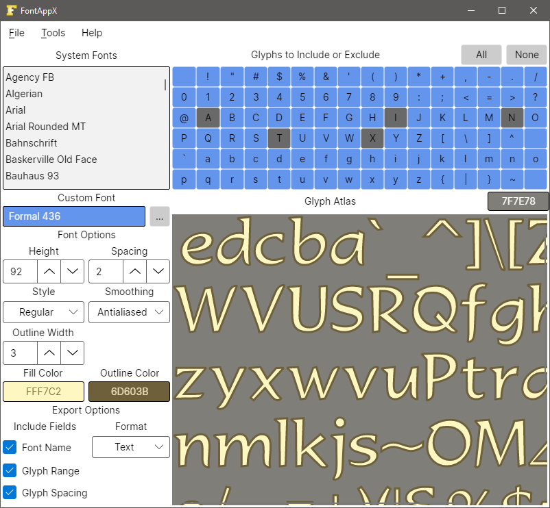

## FontApp

Somebody recently suggested that it would be good if FontApp worked on other platforms than Windows, thus FontAppX was conceived.

FontAppX is a version of my [FontApp](https://github.com/Antix-Development/FontApp) Application mostly rewritten from scratch using the [Avalonia](https://avaloniaui.net/) framework.

In theory FontAppX can be compiled to run on Linux, Mac, Android, and even inside a Browser.

Having said that however, I've only personally compiled it for Windows, so you might be in for some headaches when compiling for other platforms (if that even works).

Please note that currently FontAppX is not a fully oprational DeathStar by any means, and has one interesting rendering bug and does not yet export anything.

I've only made it public for now because I'm excited to discover if anyone can compile and run it on another platform.

I'll delete the above bollocks when it's fully working and create at least a Windows release.